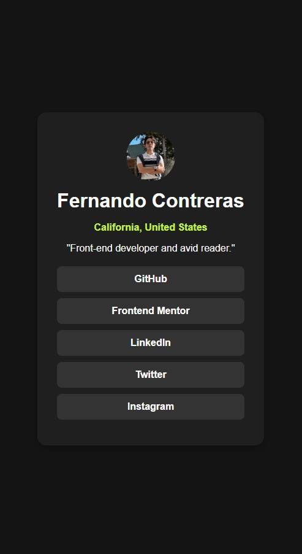
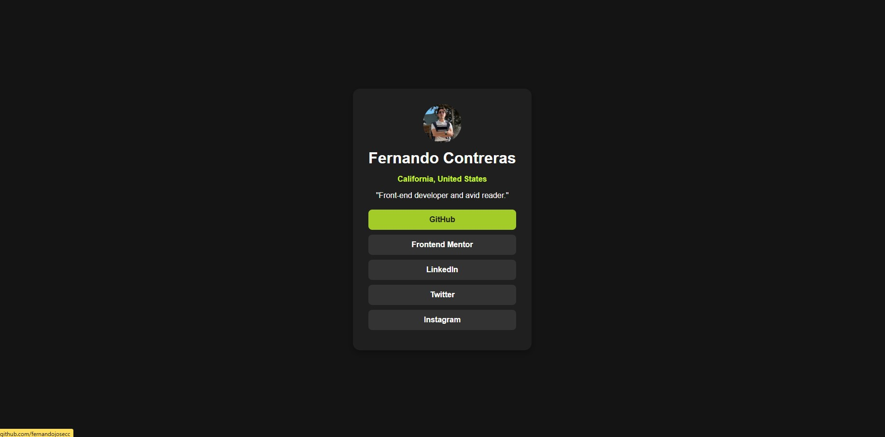

# Frontend Mentor - Social links profile solution

This is a solution to the [Social links profile challenge on Frontend Mentor](https://www.frontendmentor.io/challenges/social-links-profile-UG32l9m6dQ). Frontend Mentor challenges help you improve your coding skills by building realistic projects. 

## Table of contents

- [Overview](#overview)
  - [The challenge](#the-challenge)
  - [Screenshot](#screenshot)
  - [Links](#links)
- [My process](#my-process)
  - [Built with](#built-with)
  - [What I learned](#what-i-learned)
  - [Design Specifications](#design-specifications)
- [Author](#author)
- [Acknowledgments](#acknowledgments)

## Overview

### The challenge

Users should be able to:

- See hover and focus states for all interactive elements on the page

### Screenshot  
#### Mobile Design:  
  

#### Active States:  
  

---

### Links  
- **Solution URL**: [Solution on Frontend Mentor](https://www.frontendmentor.io/solutions/linktree-clone-css)  
- **Live Site URL**: [Live Demo](https://fernandojosecc.github.io/social-link-profile/)  

---

## My Process  

### Built With  
- **Semantic HTML5**  
- **CSS3** for styling  
- **Flexbox** for layout  
- **Responsive Design** using media queries  

---

### What I Learned  
- Improved layout techniques using Flexbox.  
- Gained experience creating responsive profile cards for social media links.  
- Practiced working with hover states and button styling.  

--- 

### Design Specifications
- Design Specifications
- Mobile width: 375px
- Desktop width: 1440px
- Responsive range: 320px to large screens
- Accessibility: WCAG compliant

# Colors
- Green: #c5f82a
- White: hsl(0, 0%, 100%)
- Grey 700: hsl(0, 0%, 20%)
- Grey 800: hsl(0, 0%, 12%)
- Grey 900: hsl(0, 0%, 8%)

# Typography
- Font family: Inter
- Weights: 400, 600, 700
- Body font size: 14px

## Author
- Frontend Mentor Profile: [@fernandojosecc](https://www.frontendmentor.io/profile/fernandojosecc)
- LinkedIn: [Fernando Contreras](https://www.linkedin.com/in/fernandojosecontreras/)
- GitHub: [@fernandojosecc](https://github.com/fernandojosecc)

## Acknowledgments
Thanks to **Frontend Mentor** for providing a platform to practice and grow as a developer!